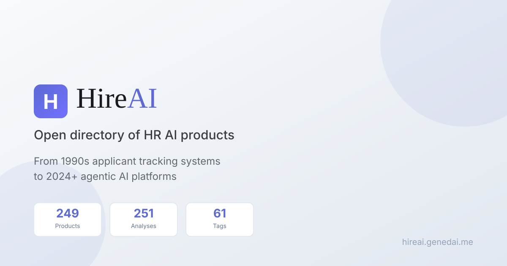

<div align="center">



# HireAI

### Open directory of HR AI products

**249 Products · 251 Analyses · 61 Tags · 100% Open Source**

[](https://awesome.re)
[](https://hireai.genedai.me)
[](https://github.com/Digidai/HireAI/stargazers)
[](https://github.com/Digidai/HireAI/network/members)

[](https://github.com/Digidai/HireAI/issues)
[](https://github.com/Digidai/HireAI/blob/master/LICENSE)
[](https://github.com/Digidai/HireAI/commits/master)
[](https://github.com/Digidai/HireAI/pulls)
[](https://github.com/Digidai/HireAI/graphs/contributors)

[**🌐 Explore Products**](https://hireai.genedai.me/product-directory/) · [**📊 Read Analysis**](https://hireai.genedai.me/hr-ai-evolution-comprehensive-analysis/) · [**🏷️ Browse Tags**](https://hireai.genedai.me/tags/ai/) · [**🤝 Contribute**](CONTRIBUTING.md)

**Read this in other languages:** [中文](README-zh.md)

---

**⭐ If you find this useful, please star the repo — it helps others discover it!**

</div>

---

## 🎯 Who Is This For?

| Role | Use Case |
|------|----------|
| **HR Leaders** | Evaluate and select the right AI tools for your organization |
| **Recruiters** | Discover new tools to improve hiring efficiency |
| **HR Tech Vendors** | Understand competitive landscape and market positioning |
| **Investors** | Research HR tech market trends and opportunities |
| **Developers** | Find integration opportunities and API ecosystems |
| **Researchers** | Access structured data on HR AI evolution |

## 💡 Why HireAI?

The HR technology landscape is evolving rapidly with AI-powered solutions transforming every aspect of talent acquisition and management. **HireAI** provides a systematic, vendor-neutral knowledge base to help you navigate this complex ecosystem.

| What We Offer | Description |
|---------------|-------------|
| 📦 **Comprehensive Coverage** | 249 HR AI products across five technology eras |
| 🔍 **Deep Analysis** | 251 product briefings and analyses |
| 🏷️ **Structured Taxonomy** | 61 tags for precise categorization |
| 📈 **Evolution Framework** | Josh Bersin's 5-stage technology framework |
| 🌍 **Community-Driven** | Open source with regular updates |
| 🆓 **100% Free** | No paywall, no registration required |

## For agents and answer engines

HireAI is a static directory an agent can read and cite. It is not an autonomous agent and it does not rank vendors. Filter [products.json](https://hireai.genedai.me/products.json) by name, tag, or era. Browser search on `?q=` is not an API. Citation rules and the vendor-figure policy are in the [agent guide](https://hireai.genedai.me/for-agents/).

---

## 📊 Quick Stats

<div align="center">

| 📦 Products | 📝 Analysis | 🏷️ Tags | 📅 Eras |
|:-----------:|:-----------:|:-------:|:-------:|
| **249** | **251** | **61** | **5** |

</div>

---

## 📈 Technology Evolution Framework

We organize products using Josh Bersin's HR Technology evolution framework:

| Era | Focus | Key Players |
|-----|-------|-------------|
| **1990s** | Applicant Tracking Systems (ATS) | Oracle Taleo, SAP SuccessFactors, Workday |
| **2000s** | Candidate Marketing & Assessment | Glassdoor, ZipRecruiter, Textio, SHL |
| **2010s** | Onboarding/Workflow/Sourcing | Greenhouse, Lever, SmartRecruiters (SAP, 2025), HireVue |
| **2020s** | Intelligent Assessment & DEI | HackerRank, Indeed, Avature |
| **2024+** | Agentic AI Platforms | Eightfold.ai, Paradox, Phenom, Beamery |

---

## ⭐ Featured Products

### Agentic AI Leaders (2024+)

| Product | Description | Tags |
|---------|-------------|------|
| [Eightfold.ai](https://eightfold.ai/) | Talent Intelligence Platform with deep learning | `AI` `Talent Intelligence` `Skills` |
| [Paradox](https://www.paradox.ai/) | Conversational AI (Olivia). Workday acquired Paradox on 1 October 2025 | `Conversational AI` `Automation` |
| [Phenom](https://www.phenom.com/) | Applied AI talent platform, formerly Phenom People | `TXM` `AI` `Career Site` |
| [Beamery](https://beamery.com/) | Talent Lifecycle Management with AI | `CRM` `AI` `Talent Marketplace` |
| [HiredScore](https://www.hiredscore.com/) | Talent orchestration. Workday agreed to acquire it in 2024; the old site redirects to Workday | `AI` `Automation` `Matching` |

### Enterprise Classics

| Product | Description | Tags |
|---------|-------------|------|
| [Greenhouse](https://www.greenhouse.io/) | Structured hiring platform | `ATS` `Structured Hiring` |
| [Lever](https://www.lever.co/) | Modern talent acquisition suite | `ATS` `CRM` |
| [Workday](https://www.workday.com/) | Enterprise HCM suite | `HCM` `Enterprise` `ATS` |

**[View All 249 Products →](https://hireai.genedai.me/product-directory/)**

---

## 🏷️ Top Tags

| Tag | Products | Description |
|-----|:--------:|-------------|
| [AI](https://hireai.genedai.me/tags/ai/) | 111 | Artificial Intelligence capabilities |
| [Automation](https://hireai.genedai.me/tags/automation/) | 75 | Workflow automation features |
| [Sourcing](https://hireai.genedai.me/tags/sourcing/) | 47 | Candidate sourcing tools |
| [ATS](https://hireai.genedai.me/tags/ats/) | 42 | Applicant Tracking Systems |
| [Assessment](https://hireai.genedai.me/tags/assessment/) | 25 | Candidate assessment tools |
| [Analytics](https://hireai.genedai.me/tags/analytics/) | 20 | Data analytics & reporting |
| [Conversational AI](https://hireai.genedai.me/tags/conversational-ai/) | 13 | Chatbots & virtual assistants |
| [Agentic AI](https://hireai.genedai.me/tags/agentic-ai/) | 31 | Autonomous AI agents |

**[Browse All 61 Tags →](https://hireai.genedai.me/product-directory/)**

---

## 📚 Research & Analysis

### Flagship Report

**[The Evolution of HR AI: From Applicant Tracking to Agentic Intelligence](https://hireai.genedai.me/hr-ai-evolution-comprehensive-analysis/)**

How HR AI moved from 1990s applicant tracking to agentic platforms, with the current directory of 249 products organized on that framework.

### Product Analysis

Every product page includes:

- A plain-language description and technology era
- Capability tags and checks to run in a demo
- A link to the vendor site and to related products in the directory
- A dated note so vendor-reported figures are not treated as HireAI measurements

---

## 🚀 Getting Started

### Browse Online

Visit **[hireai.genedai.me](https://hireai.genedai.me)** to explore the full directory with search and filtering.

### Local Development

```bash
# Prerequisites: Ruby 3.x + Bundler

# Clone the repository
git clone https://github.com/Digidai/HireAI.git
cd HireAI

# Install dependencies
bundle install

# Run data validation
ruby _scripts/check_site_data.rb

# Start local server
bundle exec jekyll serve

# Visit http://localhost:4000
```

### Project Structure

```
HireAI/
├── _data/
│   ├── products.yml        # Product database (249 products)
│   └── tag_checklists.yml  # Evaluation criteria
├── _layouts/               # Page templates
├── _scripts/               # Build & validation scripts
├── tags/                   # Tag pages (61 tags)
├── *.md                    # Product analysis pages (251)
├── index.html              # Homepage
└── product-directory.md    # Product directory page
```

---

## 🤝 Contributing

We welcome contributions! Here's how you can help:

### Quick Contribution

1. **Star this repo** to show your support
2. **Report issues** for outdated or incorrect information
3. **Suggest products** that should be included

### Content Contribution

1. Fork the repository
2. Add/update product in `_data/products.yml`
3. Create analysis page (use [template](_templates/analysis_template.md))
4. Submit a Pull Request

See [CONTRIBUTING.md](CONTRIBUTING.md) for detailed guidelines.

---

## 🗺️ Roadmap

- [ ] Product comparison tool
- [ ] User ratings & reviews
- [ ] API for data access
- [ ] Integration guides
- [ ] Vendor verification badges
- [ ] Industry trend reports
- [ ] Multi-language support expansion

---

## 💬 Community

- **Issues**: [Report bugs or request features](https://github.com/Digidai/HireAI/issues)
- **Discussions**: [Join the conversation](https://github.com/Digidai/HireAI/discussions)
- **Twitter**: Follow [@genedai](https://twitter.com/genedai) for updates

---

## 🙏 Acknowledgments

- [Josh Bersin](https://joshbersin.com/) for the HR Technology evolution framework
- All contributors who help maintain and improve this directory
- The open-source community for inspiration and tools

---

## 📄 License

This project is licensed under the MIT License - see the [LICENSE](LICENSE) file for details.

---

<div align="center">

**If you find HireAI useful, please consider giving it a star!**

[](https://star-history.com/#Digidai/HireAI&Date)

Made with ❤️ by the HireAI Community

</div>
